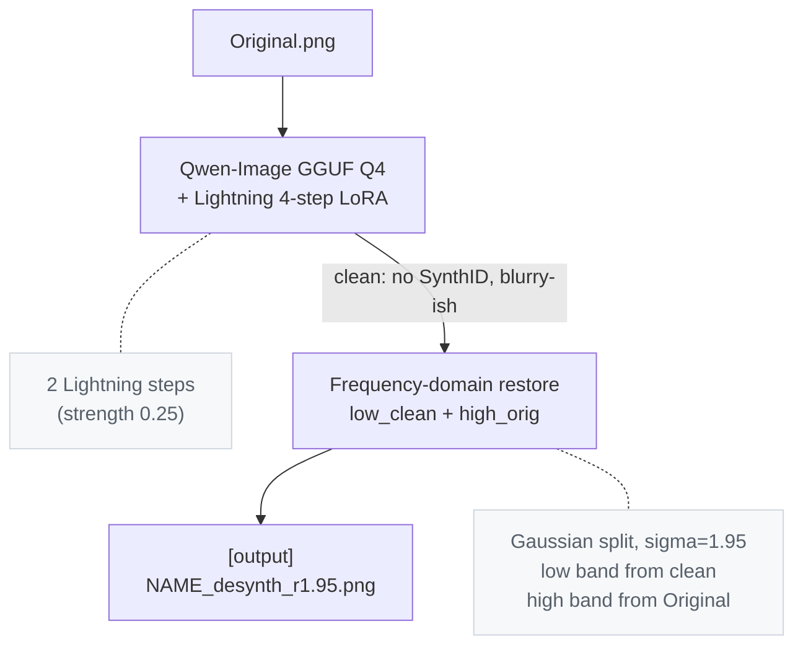

# Desynth

A tool & pipeline for removing OpenAI & Google's SynthID watermark from images.  

This is educational & research / evaluation tooling. Desynth
defeats the publicly available SynthID detectors from Google & OpenAI in our testing, but may not in the future.

## Results

All scores are reference image vs final output via `compare.py`. Both detector
verdicts come from the public SynthID detector.

### Head-to-head on the competitor's own test image (Gemini-sourced, 2752×1536)

| metric                 | our method | [competitor](https://github.com/00quebec/Synthid-Bypass) |
|------------------------|--------------:|-----------------:|
| PSNR                   |  **28.75 dB** |  20.21 dB        |
| SSIM                   |     **0.946** |     0.624        |
| SSIM (low-frequency)   |     **0.944** |     0.812        |
| SSIM (high-frequency)  |     **0.987** |     0.641        |
| MAE (lower is better)  |      **5.33** |    12.18         |
| Output resolution      |   2752×1536   |    1501×835      |
| SynthID verdict        |   not found   |    not found     |

The competitor downscales output to ~55% area; `compare.py` LANCZOS-upscales
back to compare, which compounds their loss with resampling blur. Even
discounting that, structural metrics favor our pipeline because the restore
step carries the original's mid/high-frequency band through unchanged.

### Our own test image (OpenAI-sourced, 1460×1078)

| metric                 | gaussian (default) | edge mode |
|------------------------|--------------:|--------------:|
| PSNR                   |  **32.47 dB** |   31.47 dB    |
| SSIM                   |     **0.956** |     0.948     |
| SSIM (low-frequency)   |     **0.959** |     0.955     |
| SSIM (high-frequency)  |     **0.991** |     0.984     |
| MAE                    |      **3.82** |     4.08      |
| SynthID verdict        |   not found   |   not found   |

Edge mode trades a small amount of measurable detail for better perceptual
shape continuity at contours (low- and high-bands sourced from the same image
at edge pixels) — useful for content where shape coherence matters more than
pixel-level fidelity.

## How it works



## Why it works

Five findings from empirical sweeps against the live detector:

1. **SynthID is robust to small perturbations.** Two passes of denoise=0.125
   leave it intact; a single 1-step pass also leaves it intact. It dies only
   when a denoise event is meaningful. For the Lightning LoRA on the
   Qwen-Image base, that equals **2 effective sampling steps** (denoise × steps ≥ 2).
2. **The watermark sits at a specific spatial scale.** A Gaussian low-pass at
   σ ≥ 2.0 erases it; at σ ≤ 1.95 it survives. So we can copy any sub-2-pixel
   detail from the original back onto a clean output without re-introducing
   detection — σ=1.95 is the safe ceiling that copies the most original
   detail.
3. **SynthID is not luma-only.** Lab-space restores that copy chroma straight
   from the original re-trip the detector. Watermark bits live in chroma too.
4. **SynthID has a statistical/value-distribution component.** Per-channel
   histogram matching of the model's low band toward the original's low band
   re-trips the detector — and histogram matching has zero spatial mixing.
   So the watermark isn't purely a spatial-frequency object; the detector
   keys on value-distribution fingerprints as well.
5. **The restore step is most of the quality.** Without it,
   PSNR is ~28 dB and SSIM ~0.72 with visibly drifted textures. With it:
   33 dB and 0.96. The model's job is to produce a watermark-free low-pass;
   the original supplies the fine detail.

## Usage

### One-time setup

```powershell
pip install -r requirements.txt
```

Download the two model files into the repo root (too large for GitHub):

| file                                                      | size   | source |
|-----------------------------------------------------------|--------|--------|
| `qwen-image-2512-Q4_K_M.gguf`                             | ~13 GB | [Frederic75/Qwen-Image-2512-GGUF](https://huggingface.co/Frederic75/Qwen-Image-2512-GGUF) |
| `Qwen-Image-2512-Lightning-4steps-V1.0-fp32.safetensors`  | ~1.6 GB | [lightx2v/Qwen-Image-2512-Lightning](https://huggingface.co/lightx2v/Qwen-Image-2512-Lightning) |

`embeds_cache.pt` is shipped in the repo (~430 KB), so no text-encoder
download is needed. `precompute_embeds.py` is only required if you want to
rebuild the cache with different prompts — it needs `Qwen2.5-VL-7B-Instruct-Q4_K_M.gguf` (~5 GB) one-time.

### Run

```powershell
python desynth.py                          # processes original.png
python desynth.py path\to\image.png        # processes any input
```

Output: `out/<name>_desynth_s8_d0.250_p1_r1.95.png`. Random seed per run by
default. First run downloads ~250 MB of VAE + tiny configs from Hugging Face
and caches them; all subsequent runs are fully offline.

### Flags

| flag                  | default | when to use |
|-----------------------|---------|-------------|
| `--seed N`            | random  | reproducible runs |
| `--denoise X [X X]`   | 0.25    | sweep denoise |
| `--steps N`           | 8       | per-pass step count |
| `--passes N`          | 1       | iterate img2img |
| `--restore-sigma X`   | 1.95    | tune detail restore |
| `--restore-mode M`    | gaussian | `edge` for shape-coherent contours |
| `--unsharp X`         | 0.0     | post-restore sharpen; 0.2 is the perceptual sweet spot |
| `--no-restore`        | off     | skip the frequency restore step |
| `--keep-intermediate` | off     | save the pre-restore clean output |
| `--transformer PATH`  | Q4_K_M  | try a different GGUF quant |

### Quality check

```powershell
python compare.py Original.png out\<output>.png
```

Prints PSNR, SSIM (full + low/high band), MAE, MSE, and per-channel
histogram correlation.

## Files

| file                                                      | role                                                       |
|-----------------------------------------------------------|------------------------------------------------------------|
| `desynth.py`                                              | main pipeline: img2img + restore in one call               |
| `compare.py`                                              | similarity metrics between two images                      |
| `embeds_cache.pt`                                         | cached prompt embeddings (~430 KB)            |
| `qwen-image-2512-Q4_K_M.gguf`                             | Qwen-Image transformer, GGUF Q4 quant (~13 GB)             |
| `Qwen-Image-2512-Lightning-4steps-V1.0-fp32.safetensors`  | 4-step Lightning distillation LoRA (~1.6 GB)               |

## Hardware Requirements

Tested on Windows 10, RTX 5060 Ti 8 GB, 32 GB DDR4 RAM.
Sequential CPU offload is required with < 12GB VRAM

## Known limitations

- Lightning's 4-step distillation is the source of most of the residual
  drift.  
  (Dropping it for proper 20+ step sampling would likely tighten metrics further at the cost of 5x longer
  runs.)

## Credits

Baseline workflow and watermark hypothesis from
[00quebec/Synthid-Bypass](https://github.com/00quebec/Synthid-Bypass).  
This pipeline reimplements the core idea in plain Python without ComfyUI,
ControlNet, or the face-detail path, and replaces the heavier redraw with a
two-step minimum denoise + frequency-domain restore.
